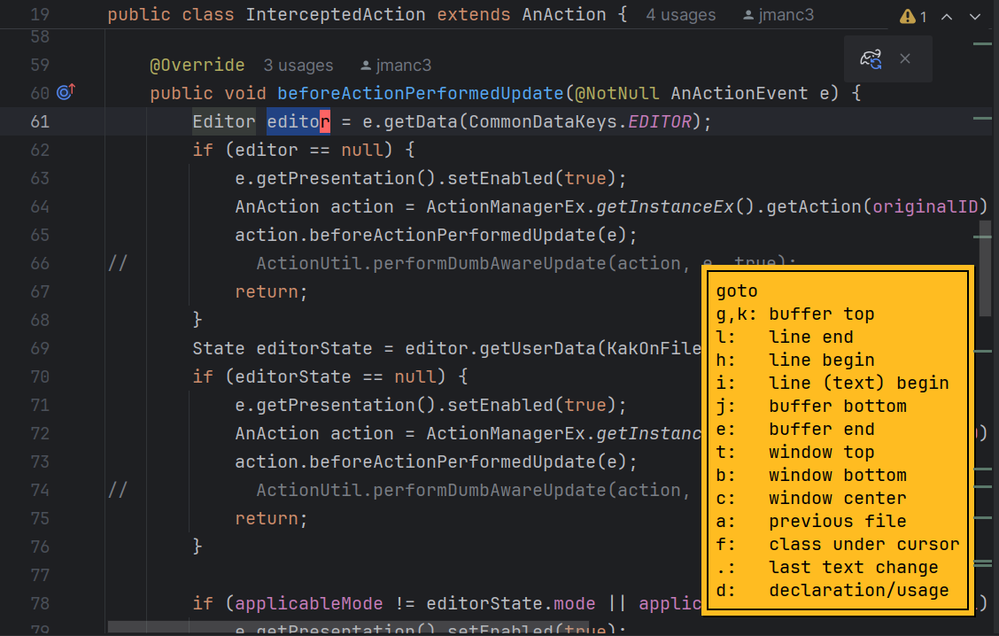

KakouneBrain
===

 

A Kakoune inspired modal text editing plugin for Jetbrains IDEs

KakouneBrain supports many Kakoune features including normal/insert modes, motion keys, deletion/changing, macros etc. Contributions which get us closer to feature parity with [Kakoune](https://kakoune.org/) or bug fixes, are welcome.

### Keybindings

| Action                                                |     Shortcut     |                          Action                           |       Shortcut        | 
|:------------------------------------------------------|:----------------:|:---------------------------------------------------------:|:---------------------:|
| enter insert mode                                     |        i         |                     leave insert mode                     | escape (or type 'jk') |
| move left                                             |        h         |                        move right                         |           l           |
| move down                                             |        j         |                          move up                          |           k           |
| move left with selection                              |        H         |                 move right with selection                 |           L           |
| move down with selection                              |        J         |                  move up with selection                   |           K           |
| next word                                             |        w         |                       previous word                       |           b           |
| next word with selection                              |        W         |               previous word with selection                |           B           |
| select word at caret (expand)                         |   shift+alt+w    |                                                           |                       |
| move current line up                                  | ctrl+shift+alt+k |                  move current line down                   |   ctrl+shift+alt+j    |
| delete                                                |        d         |                 open default replace menu                 |      r or ctrl+r      |
| undo                                                  |        u         |                           redo                            |           U           |
| move back until first blank line                      |      alt+k       |            move forward until first blank line            |         alt+j         |
| move back until first blank line + increase selection |   alt+shift+k    | move forward until first blank line + increase selection  |      alt+shift+j      |
| move up 10 lines                                      |      ctrl+k      |                    move down 10 lines                     |        ctrl+j         |
| move up 10 lines + increase selection                 |   ctrl+shift+k   |          move down 10 lines + increase selection          |     ctrl+shift+j      |
| open goto menu                                        |        g         |               open goto menu with selection               |           G           |
| close non-editor tabs                                 |        `         |            swap cursor location (on selection)            |           ;           |
| toggle zen mode                                       |        z         |                  open default find menu                   |           /           |
| new line after current                                |        o         |                  new line before current                  |           O           |
| select current line                                   |        x         |                    delete current line                    |           X           |
| cut selected, then, insert mode                       |        c         |             go to line end, then, insert mode             |           A           |
| paste before selection                                |        P         |                   paste after selection                   |           p           |
| copy text                                             |        y         |              next instance of selected text               |           n           |
| previous instance of selected text                    |      alt+n       |                      open panel menu                      |         alt+p         |
| play previous macro                                   |        q         |                start/stop macro recording                 |           Q           |
| open view menu                                        |        v         |                      open misc menu                       |           .           |
| cover letter typed                                    |        f         |               go right before letter typed                |           t           |
| cover letter typed + increase selection               |        F         |     go right before letter typed + increase selection     |           T           |
| reverse cover letter typed                            |      alt+f       |           reverse go right before letter typed            |         alt+t         |
| reverse cover letter typed + increase selection       |   alt+shift+f    | reverse go right before letter typed + increase selection |      alt+shift+t      |
| jump to next editor                                   |        ,         |                  jump to previous editor                  |           <           |
| go to file                                            |      ctrl+i      |                    open refactor menu                     |      shift+alt+r      |
| next item (while drop down open)                      |      ctrl+n      |           previous item (while drop down open)            |        ctrl+p         |

